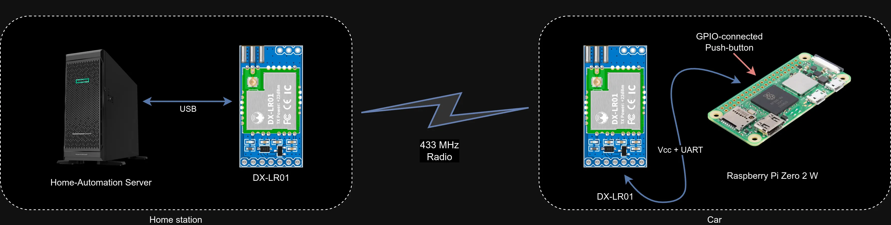

# 📡 lora-gw-rs

## About
This is a remote secure door opener project using LoRa.
There are two LoRa devices: a server (connected directly to USB port in server), and a client (Raspberry Pi Zero 2W in a car).
I just wanted to securely open doors when I am nearing my house, so I would also call it a "remote button".
As the result the server executes a script which could do whatever you want in your home automation.

## How it works
The client has attached button to a RaspberryPi GPIO port, when the button is pressed it is informing the server that is has to do some action (by default a specified script/command is called).
Transmission is encrypted.

## Hardware/connection

I am using two **DX-LR01** modules produced by [Shenzhen DX-SMART Technology Co.](http://en.szdx-smart.com/).
One is directly connected via bundled serial TTL-USB adapter to a PC, the other one is connected to a RaspberryPi UART pins. 
I've got those modules from [this offer](https://www.aliexpress.com/item/1005007264166739.html).

## Range
I am using default lowest speed for the communication to reach a max range. Initially I had a problem with range while using attached antennas - it was working up to 10-20 meters max. I bought external antennas and installed on both LoRa devices using a "pigtail" connection adapter to the external antennas. It was better but finally I unsoldered the internal antennas and the range extended to about 300-400 meters.
